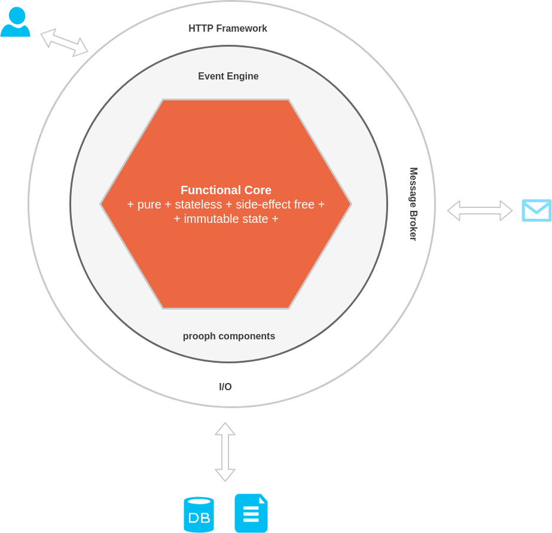
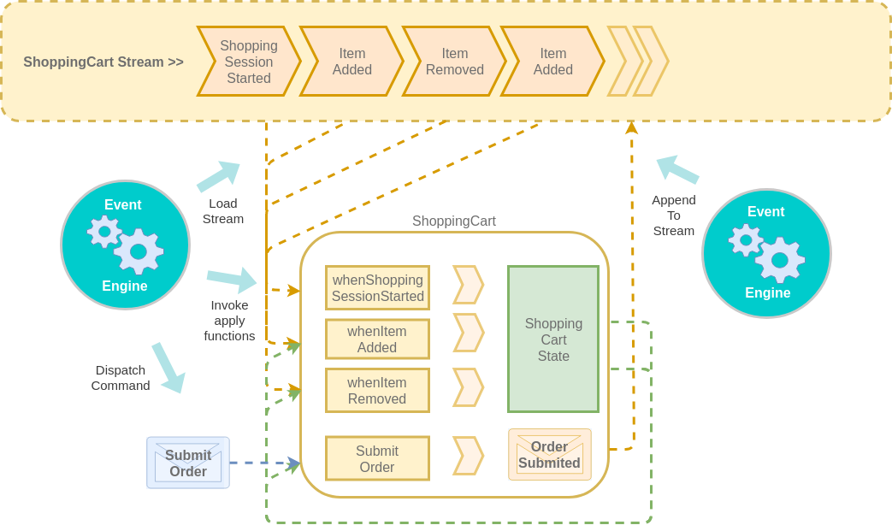

# Functional Core

> Event Sourced Aggregates are Domain-Driven Aggregates, representing a unit of consistency.
 They protect invariants. This basically means that an aggregate makes sure that it can transition to a new state.
 Different business rules can permit or prevent state transitions, and the aggregate has to enforce these business rules.

 *Source: http://docs.getprooph.org/tutorial/event_sourcing_basics.html#1-3-3*

## Functions vs. Objects

Event Engine supports three programming styles out-of-the-box: **OopFlavour, PrototypingFlavour and FunctionalFlavour**.

On this page we focus on the Prototyping and Functional Flavour. Both follow the same idea of a **functional core**.
Event Sourcing is heavily based on functional patterns:
*immutable events*, *append-only streams*, *left fold of past events to calculate current state*, ...

{.alert .alert-info}
The difference between Prototyping and Functional is that the **PrototypingFlavour** uses generic Event Engine messages while the
**FunctionalFlavour** is 100% decoupled from Event Engine. Code examples shown here are based on the PrototypingFlavour.
If you're curious how you can switch to another Flavour, then check out the Event Engine tutorial. It covers all three
Flavours in detail.

{.alert .alert-success}
**Event Engine grows with your application from prototype to MVP up to a rock solid production system**.
And it is able to reduce boilerplate code to a bare minimum. You have to follow some rules, though:

## 1. Pure Functions

Given the same input a pure function will **always** produce the same result.

Here is the simplest form of a pure aggregate function in Event Engine:

### prooph/micro style

```php
//some_business_process.php

declare(strict_types=1);

Namespace Acme\Model\SomeBusinessProcess;

use EventEngine\Messaging\Message;
use Acme\Api\Event;

const startProcess = '\Acme\SomeBusinessProcess\startProcess';

function startProcess(Message $startProcess): \Generator {
    yield [Event::SOME_PROCESS_STARTED, $startProcess->payload()];
}

//More functions ....

```

### Static method style

```php
//SomeBusinessProcess.php

declare(strict_types=1);

Namespace Acme\Model;

use EventEngine\Messaging\Message;
use Acme\Api\Event;

final class SomeBusinessProcess
{
    public static function startProcess(Message $startProcess): \Generator
    {
        yield [Event::SOME_PROCESS_STARTED, $startProcess->payload()];
    }

    //more methods ....
}

```

As you can see both approaches are very similar. The *prooph/micro* style looks more functional and underlines the intention of the code whereby the
*static method* approach plays nice together with a modern IDE and PHP's autoloading. We'll stick to the static method approach in the examples because this is
the recommended style when working with Event Engine. But *prooph/micro* style can be used, too!

Back to the **pure** nature of both approaches. No matter how often you call the function as long as the input message does not change, the yielded
event won't change, too.

{.alert .alert-info}
This property makes testing the function a breeze. You don't need mocks. You don't need heavy fixture setup. Just create the appropriate message, call the function and
test against an expected event.

## 2. Stateless Functions

No object, no internal state and therefor a much simpler business logic implementation, which is easy to test, refactor and maintain!

But even if we use functions, we have to be careful to not fall into the trap of modifying state:

{.alert .alert-danger}
**Evil Global Variable**

One way to break the rule with a function is by modifying global state.

```php
//SomeBusinessProcess.php

declare(strict_types=1);

Namespace Acme\Model;

use EventEngine\Messaging\Message;
use Acme\Api\Event;

$evilState = new EvilState();

final class SomeBusinessProcess
{
    public static function startProcess(Message $startProcess): \Generator
    {
        global $evilState;

        $evilState->burnStatelessApproach();

        yield [Event::SOME_PROCESS_STARTED, $startProcess->payload()];
    }

    //more methods ....
}

```

**Never ever do this!** Don't even think about it!

{.alert .alert-danger}
**Evil Static Property**

Another way to break our stateless function:

```php
//SomeBusinessProcess.php

declare(strict_types=1);

Namespace Acme\Model;

use EventEngine\Messaging\Message;
use Acme\Api\Event;

final class SomeBusinessProcess
{
    private static $evilState;

    public static function startProcess(Message $startProcess): \Generator
    {
        self::$evilState = new EvilState();

        yield [Event::SOME_PROCESS_STARTED, $startProcess->payload()];
    }

    public static function continueProcess(Message $continue): \Generator
    {
        yield [Event::SOME_PROCESS_CONTINUED, self::$evilState->toArray()];
    }

    //more methods ....
}

```

{.alert .alert-danger}
**Evil Static Local Variable**

That's also a very bad idea:

```php
//SomeBusinessProcess.php

declare(strict_types=1);

Namespace Acme\Model;

use EventEngine\Messaging\Message;
use Acme\Api\Event;

final class SomeBusinessProcess
{
    public static function startProcess(Message $startProcess): \Generator
    {
        yield [Event::SOME_PROCESS_STARTED, $startProcess->payload()];
    }

    public static function continueProcess(Message $continue): \Generator
    {
        static $evilCounter;

        if($evilCounter === null) {
            $evilCounter = 0;
        }

        yield [Event::SOME_PROCESS_CONTINUED, ['counter' => ++$evilCounter]];
    }

    //more methods ....
}

```

{.alert .alert-danger}
**Evil Mutable State Passed As Argument**

Mutable state passed as an argument is probably the easiest way to break the stateless rule. Let's look at an evil example first and then we'll see how we
can do better.

```php
//SomeBusinessProcess.php

declare(strict_types=1);

Namespace Acme\Model;

use EventEngine\Messaging\Message;
use Acme\Api\Event;

final class SomeBusinessProcess
{
    public static function startProcess(Message $startProcess): \Generator
    {
        yield [Event::SOME_PROCESS_STARTED, $startProcess->payload()];
    }

    public static function continueProcess(EvilMutableState $evilState, Message $continue): \Generator
    {
        $evilState->burnStatelessApproach();

        yield [Event::SOME_PROCESS_CONTINUED, ['state' => $evilState->toArray()]];
    }

    //more methods ....
}

```

{.alert .alert-success}
**Let's fight the evil!**

```php
//SomeBusinessProcess.php

declare(strict_types=1);

Namespace Acme\Model;

use EventEngine\Messaging\Message;
use Acme\Api\Event;
use Acme\Api\Payload;

final class SomeBusinessProcess
{
    public static function startProcess(Message $startProcess): \Generator
    {
        yield [Event::SOME_PROCESS_STARTED, $startProcess->payload()];
    }

    public static function whenProcessStarted(Message $processStarted): ImmutableState
    {
        return new ImmutableState();
    }

    public static function continueProcess(ImmutableState $state, Message $continue): \Generator
    {
        if($state->wantsToBurnStatelessApproach()) {
            yield [Event::STATE_MUTATION_BLOCKED, [Payload::ALTERNATIVE => $continue->get(Payload::ALTERNATIVE)]];
        }
    }

    public static function whenStateMutationBlocked(ImmutableState $currentState, Message $stateMutationBlocked): ImmutableState
    {
        return $currentState->withAlternativeMutation($stateMutationBlocked->get(Payload::ALTERNATIVE));
    }
}

```

Ok, we see two new functions here. Both start with `when` followed by an event name.

{.alert .alert-light}
Note: The naming is only a recommendation.

Those when functions do not take commands as input and do not yield events, but instead take yielded events as input and **return** (note the difference to yield)
`ImmutableState`. The second when function even takes `ImmutableState` as an argument and returns it.

To be able to understand the alternative to mutable state we have to jump into the method `withAlternativeMutation`:

```php
declare(strict_types=1);

Namespace Acme\Model;

final class ImmutableState
{
    private $alternative;

    public function alternative(): ?string
    {
        return $this->alternative;
    }

    public function withAlternativeMutation(string $alternative): self
    {
        $copy = clone $this;
        $copy->alternative = $alternative;
        return $copy;
    }
}

```

This is how state of an immutable object is changed. Instead of modifying internal state directly, the value object copies itself and modifies the copy
instead.

{.alert .alert-light}
It works because visibility of properties and methods is defined on class level and not on instance level.

Let's look at the effect with a unit test:

```php
declare(strict_types=1);

Namespace AcmeTest\Model;

use Acme\Api\Event;
use Acme\Api\Payload;
use Acme\Model\SomeBusinessProcess;
use Acme\Model\ImmutableState;
use AcmeTest\BaseTestCase; //<-- extends PHPUnit\Framework\TestCase + provides message factory
use EventEngine\Messaging\Message;

final class SomeBusinessProcessTest extends BaseTestCase
{
    /**
     * @test
     */
     public function it_does_not_change_input_state()
     {
        $inputState = new ImmutableState();

        $this->assertNull($inputState->alternative());

        $event = $this->messageFactory()->createMessageFromArray(
            Event::STATE_MUTATION_BLOCKED,
            [
                'payload' => [
                    'alternative' => 'modify and return copy'
                ]
            ]
        );

        $outputState = SomeBusinessProcess::whenStateMutationBlocked(
            $inputState,
            $event
        );

        $this->assertNull($inputState->alternative());

        $this->assertSame(
            'modify and return copy',
            $outputState->alternative()
        );
     }
}

```

{.alert .alert-success}
Working with **immutable state** avoids a whole bunch of silly and hidden errors. Function calls are predictable.
You can harden the system With simple tests, pave the way for refactorings and keep velocity high.
Event Engine also has an easy job. It does not need to care about state changes, because they are fully managed in userland code.
This means, that you have full control. **No object mapping layer required, no dirty state and no unit of work.**

{.alert .alert-info}
The [Immutable State](/api/immutable_state.html) chapter provides a lot of tips and tricks to rapidly create and work with immutable value objects.

## 3. Side-Effect Free Functions

Modifying global state is one kind of side-effect, `I/O` is another. I/O is the short term for `Input/Output` and includes things like reading from or writing to a database,
accessing the filesystem or calling a remote service. It describes any operation that might fail due to unavailability of the target system.
If a function (or method) performs a database query but the database is down, the function will behave different than in normal cases. Hence, the result of the
function call is not predictable.

{.alert .alert-warning}
Side-Effects make testing harder. Performing **I/O** usually requires mocking and you have to test against more scenarios.
That's a bad situation specifically for business logic tests. When testing business logic you should focus on its behaviour and only on that!
Mixing **I/O** into the game makes it difficult.

If we must not query a database or call a remote service in aggregate functions, where do we do it then?
Well, outside of the **functional core**. The following diagram illustrates that idea.



{.alert .alert-light}
The diagram shows three layers. The outermost layer is where `I/O` happens. Event Engine acts as a middleware between `I/O` layer and the `functional core`.

## Read I/O
We can tell Event Engine to invoke a `ContextProvider` before invoking an aggregate function.
That's the preferred way to perform read I/O to query data needed by the aggregate.

```php
<?php

declare(strict_types=1);

namespace EventEngine\Aggregate;

use EventEngine\Messaging\Message;

interface ContextProvider
{
    /**
     * @param Message $command
     * @return mixed The context passed as last argument to aggregate functions
     */
    public function provide(Message $command);
}

```

{.alert .alert-info}
Let's say we have a shopping cart aggregate that processes **AddItem** commands.
The command payload only contains the **itemId** but we also need the **price** of the item
to enable **free shipping** if a certain order sum is reached.

{.alert .alert-info}
Context Provider: uses a price finder to get item price from a **database** and sets up a free shipping policy with 40,- € (4000 Cent) as minimum order sum.

```php
<?php

declare(strict_types=1);

namespace ProophExample\ContextProvider;

use EventEngine\Aggregate\ContextProvider;
use EventEngine\Messaging\Message;
use ProophExample\ContextProvider\Api\Payload;
use ProophExample\ContextProvider\Policy\FreeShipping;
use ProophExample\ContextProvider\ShoppingCart\AddItemContext;

final class AddItemContextProvider implements ContextProvider
{
    /**
     * @var PriceFinder
     */
    private $priceFinder;

    /**
     * @param Message $command
     * @return mixed The context passed as last argument to aggregate functions
     */
    public function provide(Message $command)
    {
        $itemId = ItemId::fromString($command->get(Payload::ITEM_ID));
        $itemPrice = $this->priceFinder->findItemPrice($itemId);

        $item = Item::withIdAndPrice($itemId, $itemPrice);
        $freeShipping = FreeShipping::fromInt(4000);

        return AddItemContext::fromRecordData(['item' => $item, 'freeShipping' => $freeShipping]);
    }
}

```

{.alert .alert-info}
Command Processing Description: **AddItemContextProvider service id** (FQCN) is passed to provideContext.

```php
<?php

declare(strict_types=1);

namespace ProophExample\ContextProvider\Api;

use EventEngine\EventEngine;
use EventEngine\EventEngineDescription;
use ProophExample\ContextProvider\AddItemContextProvider;
use ProophExample\ContextProvider\ShoppingCart;

final class Aggregate implements EventEngineDescription
{
    const SHOPPING_CART = 'ShoppingCart';

    public static function describe(EventEngine $eventEngine): void
    {
        //...
        $eventEngine->process(Command::ADD_ITEM)
            ->withExisting(self::SHOPPING_CART)
            ->provideContext(AddItemContextProvider::class)
            ->handle([ShoppingCart::class, 'addItem'])
            ->recordThat(Event::ITEM_ADDED)
            ->apply([ShoppingCart::class, 'whenItemAdded'])
            ->andRecordThat(Event::FREE_SHIPPING_ENABLED)
            ->apply([ShoppingCart::class, 'whenFreeShippingEnabled']);
    }
}

```

{.alert .alert-info}
Shopping Cart Aggregate: receives **AddItemContext** as third argument in the **addItem** function

```php
<?php

declare(strict_types=1);

namespace ProophExample\ContextProvider;

use EventEngine\Messaging\Message;
use ProophExample\ContextProvider\Api\Event;
use ProophExample\ContextProvider\Api\Payload;
use ProophExample\ContextProvider\ShoppingCart\AddItemContext;
use ProophExample\ContextProvider\ShoppingCart\State;

final class ShoppingCart
{
    //...

    public static function addItem(State $cart, Message $addItem, AddItemContext $context): \Generator
    {
        yield [Event::ITEM_ADDED, [
            Payload::SHOPPING_CART_ID => $addItem->get(Payload::SHOPPING_CART_ID),
            Payload::ITEM => $context->item()->toArray(),
        ]];

        if(!$cart->freeShipping()) {
            //Temporarily add item. We can safely do this, because $cart is immutable
            $cart = $cart->withAddedItem($context->item());

            if($context->freeShipping()->isFree($cart->orderSum())) {
                yield [Event::FREE_SHIPPING_ENABLED, [
                    Payload::SHOPPING_CART_ID => $addItem->get(Payload::SHOPPING_CART_ID),
                ]];
            }
        }
    }

    public static function whenItemAdded(State $cart, Message $itemAdded): State
    {
        return $cart->withAddedItem(Item::fromArray($itemAdded->get(Payload::ITEM)));
    }

    public static function whenFreeShippingEnabled(State $cart, Message $freeShippingEnabled): State
    {
        return $cart->withFreeShippingEnabled();
    }
}

```

## Write I/O

Event Engine appends all yielded events to the `write model event stream`. You don't need to care about that.
Read model updates are performed by projections (@TODO add link) or the Multi-Model-Store (@TODO add link) 
and all other Write I/O should happen in event listeners (@TODO add link).

{.alert .alert-warning}
Aggregate functions should NEVER perform any write operation directly but only yield events to trigger Write I/O in the outermost layer.

## Aggregate Lifecycle

{.alert .alert-warning}
If an aggregate is composed of pure functions and those functions work with immutable state only, does the aggregate have a lifecycle?

Yes! An aggregate has a lifecycle. It is just not implemented as an object that changes internal state over time.
But an aggregate is still a domain concept - a business process.
Each aggregate has a **unique id** and yielded events should contain that id (otherwise Event Engine throws an exception)
so that the events can be added to the **event stream** of the aggregate.
An event stream can be seen as a timeline. It tracks all important facts about the aggregate.


{.alert .alert-light}
But how can Event Engine always pass the current state of an aggregate to the next function?

It seems like aggregate state is magically passed to aggregate functions. But the mechanism used by Event Engine is relatively simple.
It is best explained with our shopping cart example again.

```php
$eventEngine->process(Command::START_SHOPPING_SESSION)
    ->withNew(self::SHOPPING_CART)
    ->identifiedBy(Payload::SHOPPING_CART_ID)
```

Event Engine gets two important information here. The first one is that the lifecycle of our `ShoppingCart` aggregate
begins with a `StartShoppingSession` command. And the second is that a `ShoppingCart` is identified by its `ShoppingCartId`.
**All** commands addressing the shopping cart should contain the `ShoppingCartId` and **all** events yielded by the aggregate should contain the same
id.


```php
$eventEngine->process(Command::START_SHOPPING_SESSION)
        ->withNew(self::SHOPPING_CART)
        ->identifiedBy(Payload::SHOPPING_CART_ID)
    ->handle([ShoppingCart::class, 'startShoppingSession'])
```

Given the information above, Event Engine knows that the aggregate function `ShoppingCart::startShoppingSession()`
only takes a `StartShoppingSession` command as argument. 

{.alert .alert-light}
Aggregate state doesn't exist at this time because it's the first command.

```php
<?php

//...

final class ShoppingCart
{
    public static function startShoppingSession(Message $startShoppingSession): \Generator
    {
        yield [Event::SHOPPING_SESSION_STARTED, [
            Payload::SHOPPING_CART_ID => $startShoppingSession->get(Payload::SHOPPING_CART_ID),
        ]];
    }

    //...
}
```

Event Engine will append the yielded `ShoppingSessionStarted` event to its `write model event stream`. This event will mark the beginning
of a new shopping cart lifecycle.

Every yielded event should have a corresponding **apply function**. Event Engine takes care of that rule.
It's the last part of every [CommandProcessingDescription](/api/descriptions.html#3-2-4).

```php
$eventEngine->process(Command::START_SHOPPING_SESSION)
        ->withNew(self::SHOPPING_CART)
        ->identifiedBy(Payload::SHOPPING_CART_ID)
        ->handle([ShoppingCart::class, 'startShoppingSession'])
    ->recordThat(Event::SHOPPING_SESSION_STARTED)
    ->apply([ShoppingCart::class, 'whenShoppingSessionStarted']);
```

A `recordThat` call should always be followed by an `apply` call. Obvousely, it's a mapping so that Event Engine knows which `apply` function to use.
And because the entire description is bound to the command being processed, Event Engine knows again that `ShoppingCart::whenShoppingSessionStarted` is the first
apply function and therefor does not take aggregate state as an argument. But the apply function should return the first **immutable state** derived from the first event.

```php
<?php

//...

final class ShoppingCart
{
    //...

    public static function whenShoppingSessionStarted(Message $shoppingSessionStarted): State
    {
        return State::newSession(ShoppingCartId::fromString(
            $shoppingSessionStarted->get(Payload::SHOPPING_CART_ID)
        ));
    }
}
```

{.alert .alert-info}
All subsequent aggregate functions (command handling and event applying functions) receive the current aggregate state as the first argument.

The following diagram illustrates how Event Engine calculates current state with the help of the `apply` functions.



## RecordThat

The `CommandProcessingDescription` defines two aliases for `recordThat`: `andRecordThat` and `orRecordThat`. You can use them when an aggregate function
yields multiple events (andRecordThat) or different events depending on conditions (orRecordThat).

{.alert .alert-warning}
Event Engine doesn't really care about which variant you use, but if an aggregate function yields an unknown event (no recordThat->apply pair defined)
Event Engine will throw an exception.

```php
$eventEngine->process(Command::ADD_ITEM)
        ->withExisting(self::SHOPPING_CART)
        ->provideContext(AddItemContextProvider::class)
        ->handle([ShoppingCart::class, 'addItem'])
    ->recordThat(Event::ITEM_ADDED)
        ->apply([ShoppingCart::class, 'whenItemAdded'])
    ->andRecordThat(Event::FREE_SHIPPING_ENABLED)
        ->apply([ShoppingCart::class, 'whenFreeShippingEnabled']);
```

{.alert .alert-light}
It's not required that all events are yielded each time. The important thing is that Event Engine knows about them all.

In some situations an aggregate function does not want to yield any new event. In such a case you can `yield null` and return from the function.


```php
<?php

//...

final class ShoppingCart
{
    //...

    public static function removeItem(State $cart, Message $removeItem): \Generator
    {
        $item = Item::fromArray($removeItem->get(Payload::ITEM));

        if(!$cart->hasItem($item)) {
            yield null;
            return;
        }

        yield [Event::ITEM_REMOVED, $removeItem->payload()];
    }
}
```

{.alert .alert-info}
**Wrap UP:** Aggregates in Event Engine are composed of pure functions and immutable state (when using Prototyping or Functional Flavour). Command Processing Descriptions tell Event Engine how the pieces fit
together. This reduces boilerplate code and we can focus on the domain and avoid silly bugs that interrupt our model exploration.
