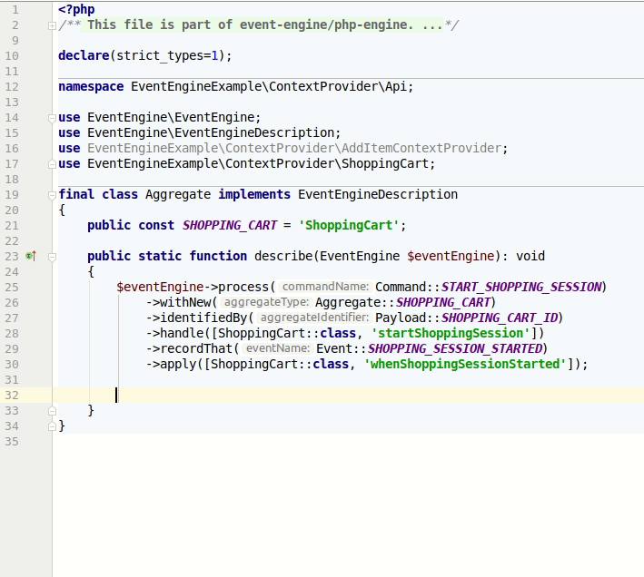

# Descriptions


In the previous chapter "Set Up" we already learned that Event Engine loads `EventEngineDescription`s and passes itself as the only argument
to a static `describe` method.

```php
<?php

declare(strict_types=1);

namespace Prooph\EventEngine;

interface EventEngineDescription
{
    public static function describe(EventEngine $eventEngine): void;
}

```

{.alert .alert-warning}
Descriptions need to be loaded **before** `EventEngine::initialize()` is called.

{.alert .alert-light}
In the skeleton descriptions are listed in [src/Domain/DomainServices.php](https://github.com/event-engine/php-engine-skeleton/blob/master/src/Domain/DomainServices.php#L16){: class="alert-link"}
and this list is read by the event engine factory method in `src/ServiceFactory`:

```php
public function eventEngine($notInitialized = false): EventEngine
{
    if($notInitialized) {
        $eventEngine = new EventEngine(new OpisJsonSchema());
        foreach ($this->eventEngineDescriptions() as $description) {
            $eventEngine->load($description);
        }
        return $eventEngine;
    }
    
    $this->assertContainerIsset();
    
    return $this->makeSingleton(EventEngine::class, function () {
        $eventEngine = new EventEngine(new OpisJsonSchema());
        foreach ($this->eventEngineDescriptions() as $description) {
            $eventEngine->load($description);
        }
        $eventEngine->initialize(
            $this->flavour(),
            $this->multiModelStore(),
            $this->logEngine(),
            $this->container
        );
        return $eventEngine;
    });
}
```

{.alert .alert-info}
**Organising Descriptions:**
If you followed the tutorial, you already know that you can avoid code duplication and typing errors with a few simple tricks.
Clever combinations of class and constant names can provide readable code without much effort. The skeleton ships with default Event Engine Descriptions
to support you with that idea. You can find them in [src/Domain/Api](https://github.com/event-engine/php-engine-skeleton/tree/master/src/Domain/Api){: class="alert-link"}

## Registration API

Event Engine provides various `registration` methods. Those methods can only be called during **description phase**. 

{.alert .alert-light}
See [Set Up chapter](/api/set-up/installation.html#3-1-1-3) for details about bootstrap phases.

Here is an overview of available methods:

```php
<?php

declare(strict_types=1);

namespace Prooph\EventEngine;

//...

final class EventEngine implements MessageDispatcher, AggregateStateStore
{
    //...

    /**
     * Add a command message to the system along with its payload schema
     */
    public function registerCommand(string $commandName, PayloadSchema $schema): self
    {
        //...
    }

    /**
     * Add an event message to the system along with its payload schema
     */
    public function registerEvent(string $eventName, PayloadSchema $schema): self
    {
        //...
    }

    /**
     * Add a query message to the system along with its payload schema (optional for queries)
     */
    public function registerQuery(string $queryName, PayloadSchema $payloadSchema = null): QueryDescription
    {
        //...
    }
    
    /**
     * Add a data type to the system along with its schema
     */
    public function registerResponseType(string $nameOrImmutableRecordClass, ResponseTypeSchema $schema = null): void
    {
        //...
    }

    /**
     * Alias for registerResponseType()
     */
    public function registerType(string $nameOrImmutableRecordClass, ResponseTypeSchema $schema = null): void
    {
        //...
    }
    
    /**
     * Add an input data type to the system along with its schema
     * 
     * If the schema implemenation distinguishes between input and data types (f.e. a GraphQL implementation)
     * you can use registerReponseType() and registerInputType() explicitly 
     */
    public function registerInputType(string $nameOrImmutableRecordClass, InputTypeSchema $schema = null): void
    {
        //...
    }

    /**
     * Service id or instance of a CommandPreProcessor invoked before command is dispatched
     * 
     * You can register many preprocessors per command. Think of it like a middleware pipeline.
     *
     * @param string $commandName
     * @param string | CommandPreProcessor $preProcessor
     */
    public function preProcess(string $commandName, $preProcessor): self
    {
        //...
    }
    
    /**
     * Service id or callable command controller invoked for command instead of an aggregate
     *
     * You can use controllers for non-aggregate business logic, migrations and more
     * A command can either be handled by an aggregate or a controller. 
     * Event Engine takes care of this. 
     * 
     * @param string $commandName
     * @param string|callable $controller
     * @return EventEngine
     */
    public function passToController(string $commandName, $controller): self
    {
        //...
    }

    /**
     * Describe handling of a command using returned CommandProcessorDescription
     */
    public function process(string $commandName): CommandProcessorDescription
    {
        //...
    }

    /**
     * Service id or callable event listener invoked after event is written to event stream
     *
     * @param string $eventName
     * @param string | callable $listener
     */
    public function on(string $eventName, $listener): self
    {
        //...
    }

    /**
     * Describe a projection by using returned ProjectionDescription
     */
    public function watch(Stream $stream): ProjectionDescription
    {
        //...
    }

    //...
}

```

## Message Payload Schema

Messages are like HTTP requests, but they are protocol agnostic. For HTTP requests/responses PHP-FIG has defined a standard known as PSR-7. Event Engine messages on the other hand are similar to [prooph/common messages](https://github.com/prooph/common/blob/master/docs/messaging.md).

Like HTTP requests **messages should be validated before doing anything with them**. It can become a time consuming task to write validation logic for each message
by hand. Hence, Event Engine has a built-in way to validate messages using a [Schema](#) (@TODO add link).

The package [event-engine/php-json-schema](https://github.com/event-engine/php-json-schema) provides a [Json Schema Draft 6](http://json-schema.org/specification-links.html#draft-6) compatible implementation.

You can use `JsonSchema` wrapper objects. Those objects are easy to use and drastically improve
readability of the code.

Here is a command registration example:

```php
$eventEngine->registerCommand(
    self::REGISTER_USER,
    JsonSchema::object([
        Payload::USER_ID => Schema::userId(),
        Payload::USERNAME => Schema::username(),
        Payload::EMAIL => Schema::email(),
    ])
);
```

{.alert .alert-success}
This code speaks for itself, doesn't it? Once you're used to it you can add new messages to the system in less than 30 seconds.
The chapter about [Json Schema](#) (@TODO add link) covers all the details. Make sure to check it out.

{.alert .alert-light}
A nice side effect of this approach is out-of-the-box [Swagger UI](https://swagger.io/tools/swagger-ui/){: class="alert-link"} support. 
Learn more about it in the [Swagger UI](#) (@TODO add link) chapter.

## Command Registration

Event Engine needs to know which commands can be processed by the system. Therefor, you have to register them before defining processing logic.

{.alert .alert-light}
Software developed with Event Engine follows a Command-Query-Responsibility-Segregation (short CQRS) approach.
Commands are used to trigger state changes without returning modified state and queries are used to request current state without modifying it.

You're ask to tell Event Engine a few details about available commands. Each command should have a **unique name** and a **payload schema**.
It is recommended to add a context as prefix in front of each command name. Let's take an example from the tutorial but add a context to the command name:

```php
<?php

declare(strict_types=1);

namespace App\Api;

use Prooph\EventEngine\EventEngine;
use Prooph\EventEngine\EventEngineDescription;
use Prooph\EventEngine\JsonSchema\JsonSchema;

class Command implements EventEngineDescription
{
    const CMD_CXT = 'BuildingMgmt.';
    const ADD_BUILDING = self::CMD_CXT.'AddBuilding';

    /**
     * @param EventEngine $eventEngine
     */
    public static function describe(EventEngine $eventEngine): void
    {
        $eventEngine->registerCommand(
            Command::ADD_BUILDING,
            JsonSchema::object(
                [
                    'buildingId' => JsonSchema::uuid(),
                    'name' => JsonSchema::string()->withMinLength(2)
                ]
            )
        );
    }
}

```


Event Engine makes no assumptions about the format of the name. A common approach is to use a *dot notation* to separate context from message name
e.g. `BuildingMgmt.AddBuilding`. Using *dot notation* has the advantage that message broker like RabbitMQ can use it for routing.

## Command Processing

Once Event Engine knows about a command you can register processing logic for it. Commands are processed by **aggregate functions**. Think of an aggregate as a process with
multiple steps. Each step is triggered by a command and there is only one active step for a specific process aka. aggregate at the same time.


In Event Engine aggregate functions are **stateless**. You can use plain PHP functions or classes with static public methods.

Before we dive deeper into aggregate functions, let's have a look at how commands are processed.
The following gif shows a `CommandProcessingDescription`.

{.alert .alert-success}
A fluent interface mixed with clever class and constant naming + modern IDE support (PHPStorm in this case)
can assist you while putting together the pieces. You need to remember less which frees your mind to reason more about
the logic you're developing. This results in a **higher quality business logic, written in a shorter time.**
Try it yourself. It's actually a lot of fun to work with Event Engine.

{.alert .alert-info}
Keep an eye on the array callable syntax: `[ShoppingCart::class, 'addItem']`. PHPStorm provides code completion for it and respects it while renaming methods and classes.
That's an awesome feature and makes the syntax save to use.



{.alert .alert-success}
Event Engine Descriptions keep glue code outside of the core business logic. This reduces "noise" in the core and creates
a central overview for navigation through the code.

Let's go through the CommandProcessingDescription step by step.

### process()

The `process(string $commandName)` method takes a command name as input and starts a **CommandProcessingDescription** for that command.

{.alert .alert-warning}
If the command is not registered or a second processing description exists for it, Event Engine raises an exception.
There can always only be one handler for a command be it an aggregate or a controller. You can only attach multiple
command preprocessors to the same command.

```php
$eventEngine->process(Command::START_SHOPPING_SESSION)
```

### withNew()

{.alert .alert-info}
Event Engine Descriptions are really meant to be descriptive. This way you can internalize the required steps
to build a CQRS / ES system. The descriptions also serve as documentation. A developer new to the system just needs
to read them to get an idea of the structure and business logic.

That said, description methods are named to form a sentence. If a command should create a new aggregate use `withNew(string $aggregateType)` after `process()`
and pass the aggregate type as an argument:

```php
$eventEngine->process(Command::START_SHOPPING_SESSION)
    ->withNew(Aggregate::SHOPPING_CART)
```
### identifiedBy()

If a new aggregate should be created, you have to tell Event Engine which command property contains the aggregate identifier. This is done 
with `identifiedBy(string $identifierPropName)`:

```php
$eventEngine->process(Command::START_SHOPPING_SESSION)
    ->withNew(Aggregate::SHOPPING_CART)
    ->identifiedBy(Payload::SHOPPING_CART_ID)
```

You can omit `identifiedBy()` in further CommandProcessingDescriptions addressing the same aggregate type as long as all commands and events always contain the same
aggregate identifier property. If this is not the case, you can also add `identifiedBy()` after `withExisting()` to define an alternative property name for the specific command 
and related events.

{.alert .alert-warning}
If you omit `identifiedBy()` at all, Event Engine uses the default property name `id` and throws an exception if the command does not contain it.

### withExisting()

Like the name suggests, `withExisting(string $aggregateType)` should be used if a command addresses an existing aggregate. Event Engine will use the aggregate type and the identifier property from the
command to look up the aggregate and bring it into current state ready to handle the command.

{.alert .alert-success}
Loading aggregates is managed by Event Engine internally. No command handlers or repositories required.   

```php
$eventEngine->process(Command::ADD_ITEM)
    ->withExisting(Aggregate::SHOPPING_CART)
```

### provideContext()

`provideContext(string $providerServiceId)` allows you to attach a context provider 
to the command. It should be a **service id**. Event Engine pulls the context provider from the [PSR-11 container](/api/set_up/di.html#3-1-2-5).

```php
$eventEngine->process(Command::ADD_ITEM)
    ->withExisting(Aggregate::SHOPPING_CART)
    ->provideContext(AddItemContextProvider::class)
```

{.alert .alert-light}
Aggregate functions should not have any side effects. This is explained in the [Functional Core](/api/aggregates/functional_core.html) chapter.
But to make decisions like: "Should a command be handled or not and in what way?" - an aggregate sometimes requires information not included in its own state.
This information needs to be loaded either from an external system or a database. To keep aggregates focused on the business logic, external
information should be loaded beforehand. A context provider takes care of loading information. It can manage communication, deal with errors and caching.
Once loaded, the information is handed over as context to the aggregate function. 

{.alert .alert-danger}
While Event Engine makes no assumptions about the context format, it is highly recommended to only use [immutable objects](/api/state/immutable_state.html) as contexts.
In rare cases it might be required to pass a data resolver down to the aggregate, f.e. if the aggregate needs to decide if external data is really needed and fetching it beforehand is too costly.
You can use a context object to pass dependencies into aggregate functions. But use it with care!

### handle()

`handle(callable $aggregateFunc)` takes a `callable` as input. This is usually the aggregate function responsible for handling the command.

```php
$eventEngine->process(Command::ADD_ITEM)
    ->withExisting(Aggregate::SHOPPING_CART)
    ->provideContext(AddItemContextProvider::class)
    ->handle([ShoppingCart::class, 'addItem'])
```

{.alert .alert-light}
The recommended approach is to group aggregate functions in classes using static class methods. This way, you can use PHP's array callable syntax like shown in the example.
Thanks to the syntax, Event Engine can cache the Description. If you pass a `Closure` to `handle()`, caching won't work, because closures can't be exported. Event Engine takes
care of that limitation and throws an exception if needed.

{.alert .alert-warning}
If you use the `OopFlavour` please refer to the [OopFlavour tutorial part](/tutorial/bonus_IV.html){: class="alert-link"}. 
It explains how to describe command processing when aggregate functions are not stateless.

### recordThat() & apply()

Tell Event Engine what possible events are yielded for a command using `recordThat(string $eventName)` or one of the aliases `andRecordThat(string $eventName)` or `orRecordThat(string $eventName)`.
Every `recordThat()` call should be followed by an `apply(callable $eventApplyFunc)` call, which takes a `callable` aggregate apply function for the event as argument.

```php
$eventEngine->process(Command::ADD_ITEM)
    ->withExisting(Aggregate::SHOPPING_CART)
    ->provideContext(AddItemContextProvider::class)
    ->handle([ShoppingCart::class, 'addItem'])
    ->recordThat(Event::ITEM_ADDED)
    ->apply([ShoppingCart::class, 'whenItemAdded'])
    ->andRecordThat(Event::FREE_SHIPPING_ENABLED)
    ->apply([ShoppingCart::class, 'whenFreeShippingEnabled']);
```

{.alert .alert-info}
The aggregate handle function doesn't need to yield all specified events each time and the recordThat aliases are only defined for better readability.
The important thing is, that Event Engine knows all events and their corresponding apply functions.

### storeStateIn()

`storeStateIn(string $collection)` tells Event Engine to store the aggregate state in the specified document store collection.
This description only takes effect when using a [Multi-Model-Store](#) (@TODO add link). It can only be used when describing 
command processing for a **NEW** aggregate:

```php
$eventEngine->process(Command::START_SHOPPING_SESSION)
    ->withNew(Aggregate::SHOPPING_CART)
    ->identifiedBy(Payload::SHOPPING_CART_ID)
    ->storeStateIn('shopping_carts')
    // ...
```


{.alert .alert-info}
If you don't specify a collection, Event Engine defaults to:

```php
$aggregateCollection = AggregateProjector::aggregateCollectionName(
   '0.1.0', // <- Default projection version
   Aggregate::SHOPPING_CART // <- Aggregate type of command processing description
);

echo $aggregateCollection; // em_ds_shopping_cart_0_1_0
```

{.alert .alert-warning}
Make sure to create the collection upfront! It is **NOT** created automatically by Event Engine.
The tutorial provides some [guidance](/tutorial/partIII.html#2-4-2).

### storeEventsIn()

By default, Event Engine writes all events into its `WriteModelStream`. If you wish to write events for a certain 
aggregate type into a separate stream, you can use `storeEventsIn(string $streamName)`. Like `storeStateIn()`, you can
define an alternative stream only when describing command processing for a **new** aggregate. 

```php
$eventEngine->process(Command::START_SHOPPING_SESSION)
    ->withNew(Aggregate::SHOPPING_CART)
    ->identifiedBy(Payload::SHOPPING_CART_ID)
    ->storeStateIn('shopping_carts')
    ->storeEventsIn('shopping_cart_history')
    // ...
```

{.alert .alert-warning}
You need to take care of creating alternative event streams. The skeleton includes an [example script](https://github.com/event-engine/php-engine-skeleton/blob/master/scripts/create_event_stream.php).
Just change the stream name.

## passToController()

If you don't want to handle a command with an aggregate, you can pass it to a [command controller](#) (@TODO add link) instead:

```php
$eventEngine->passToController(MyCommandController::class);
```

The controller instance is pulled from the [PSR-11 container](/api/set_up/di.html#3-1-2-5) using the **service id** handed over to `passToController()`.

{.alert .alert-warning}
A command can either be handled by a controller or an aggregate, but not both. A command always has one handler only.

## Event Registration

Event registration works similar to command registration [described above](#3-2-3).
Before you can reference events in [command processing descriptions](#3-2-4) they need to be known by Event Engine.
This mechanism protects you from silly mistakes like misspelling an event name or forgetting to define a schema for it.

```php
$eventEngine->registerEvent(
    self::USER_REGISTERED,
    JsonSchema::object([
        Payload::USER_ID => Schema::userId(),
        Payload::USERNAME => Schema::username(),
        Payload::EMAIL => Schema::email(),
    ])
);
```

## Attach Process Manager

One of the strengths of Event Sourcing is the ability to automate processes using an Event-Driven approach. This means, that follow up actions can be triggered when certain events 
occur. Those automatic triggers are called process managers. Here is an example how you attach a process manager to an event:

```php
$eventEngine->on(Event::USER_REGISTERED, SendWelcomeEmail::class);
```

If a process manager has dependencies, pass a **service id** to `$eventEngine->on()` so that it is pulled from the [PSR-11 container](/api/set_up/di.html#3-1-2-5).
A stateless process manager that listens on an event to dispatch a new command, can be provided as a `callable`. It's recommended to use the array callable syntax like
discussed for [aggregate functions](#3-2-4-6).

Let's look at an example: 

{.alert .alert-info}
Whenever an order was placed the system should generate an invoice.

```php
final class GenerateInvoiceTrigger
{
    public static function onOrderPlaced(Message $orderPlaced): array 
    {
        return [
            Command::GENERATE_INVOICE,
            [
                Payload::ORDER_ID => $orderPlaced->get(Payload::ORDER_ID)    
            ]    
        ];
    }
}
```

A process manager can return a command using the "short message syntax" of Event Engine.
The command is automatically dispatched by Event Engine. The only thing we need to do is
to attach the process manager function to the correct event:

```php
$eventEngine->on(Event::ORDER_PLACED, [GenerateInvoiceTrigger::class, 'onOrderPlaced']);
```

@TODO Describe query, type and projection registration


