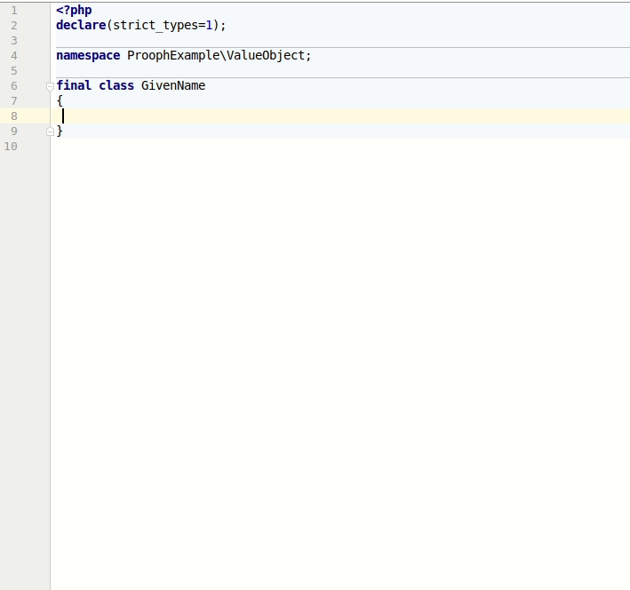
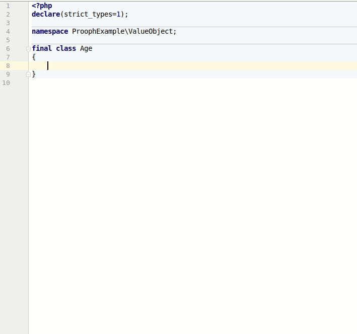
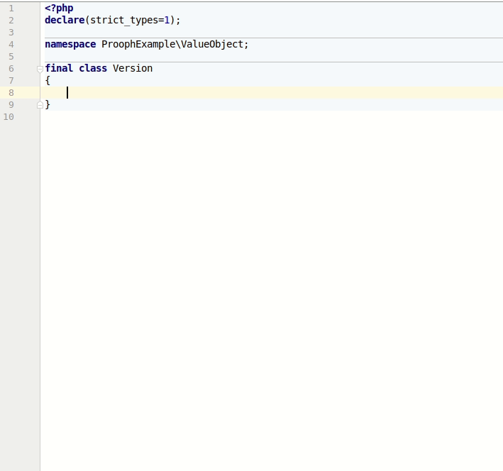
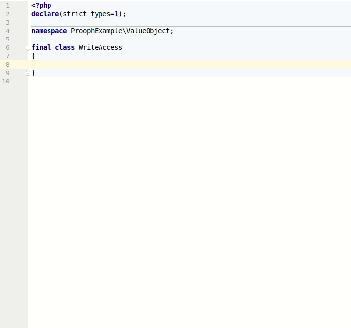
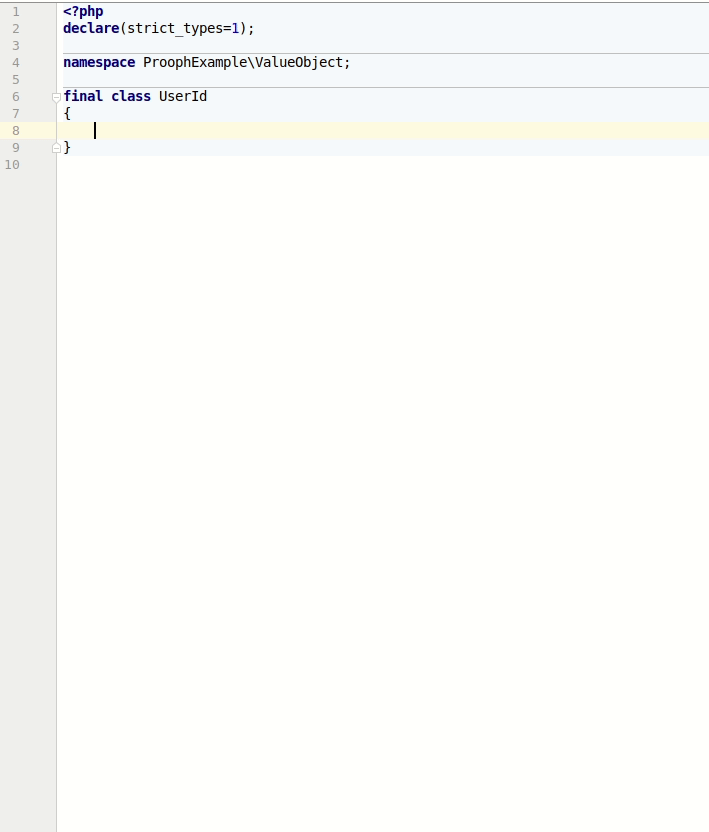
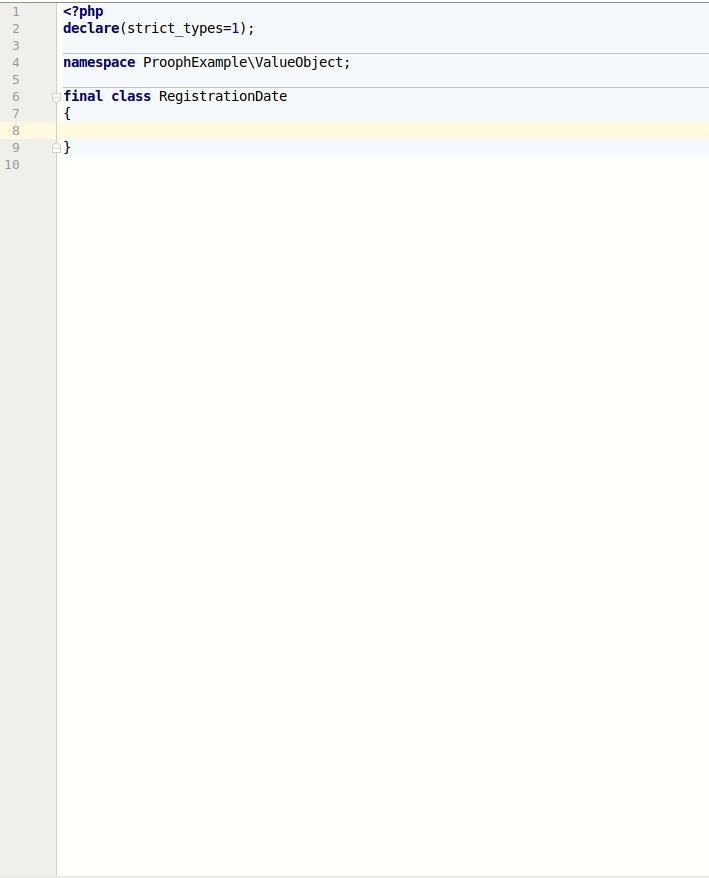
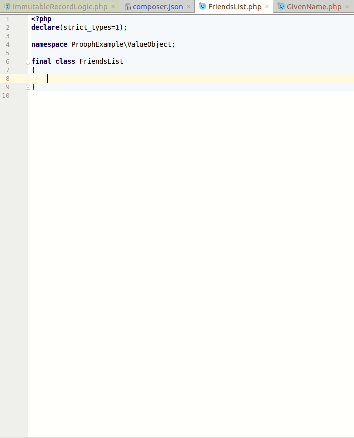
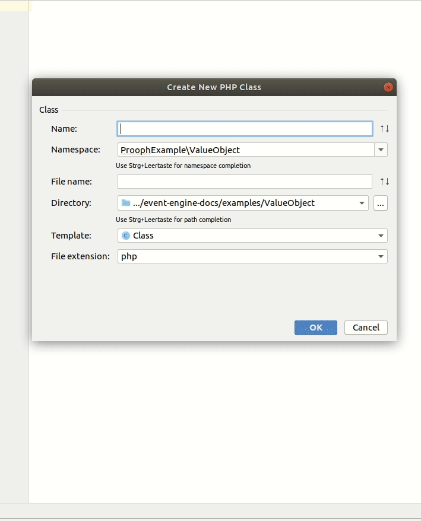
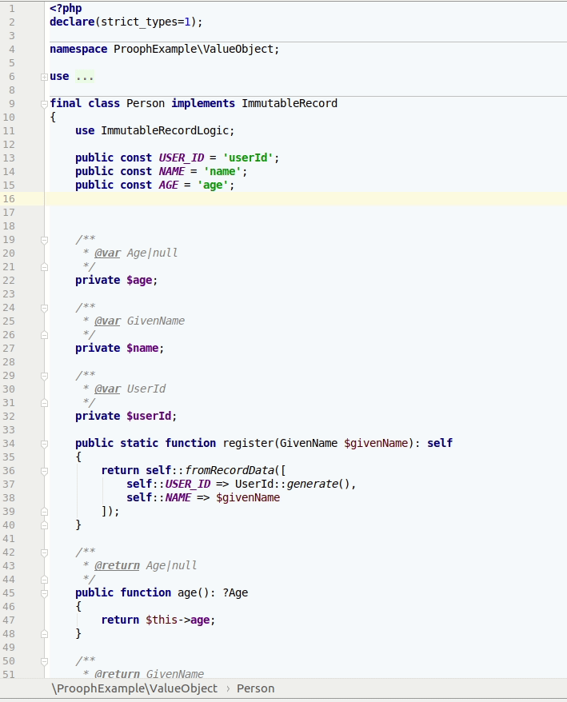

# Immutable State

Using immutable objects whenever possible results in robust implementations. Function calls and state changes become predictable.
Using value objects instead of raw data structures like arrays or plain strings adds type safety, acts as documentation and makes code much more 
readable. All very important properties for long-lived applications that are constantly reshaped.

The `EventEngine\Data` package provides useful helpers to speed up development of immutable objects. In fact, when using the Prototyping or Functional
Flavour **all application state should be immutable**. 

{.alert .alert-warning}
For the OOP Flavour the only exception are Aggregate Roots. But even then it's recommended
to use a single internal state property within the AR that references immutable state and is the only mutable part of the object.

## PHPStorm Templates

Writing immutable value objects in PHP is painful because you need a lot of boilerplate code and always have the risk to 
introduce bugs due to typos. 

Libraries like [FPP](https://github.com/prolic/fpp) aim to simplify the task of writing immutable objects and combine them to complex structures. 

{.alert .alert-dark}
FPP works quite well and you can use it together with Event Engine. 

However, if you don't want to learn another meta language but still want to avoid writing all the boilerplate that comes along with immutable objects,
`EventEngine\Data` combined with PHPStorm Live Templates might be for you.

{.alert .alert-info}
Keep in mind that both FPP and EventEngine\Data are only suggestions. You don't have to use them. It's also fine if you prefer working with a serializer library. 

The `EventEngine\Data` package contains a set of live templates specifically designed to work together with the `EventEngine\Data\ImmutableRecord`. 

You can import the templates by following official [PHPStorm instructions](https://www.jetbrains.com/help/phpstorm/sharing-live-templates.html).
Please find the `settings.zip` [here](https://github.com/event-engine/php-engine/blob/master/.env/PHPStorm/settings.zip).

## Scalar Value Objects

Each scalar PHP type (string, int, float, bool) has a corresponding template that you can access by typing `vo_<scalar type>` in a PHP file.

1. Create an empty value object class.
2. Invoke the template in the class body.
3. Define the name of the inner property.

See examples:

<ul class="nav nav-tabs">
    <li class="active"><a data-toggle="tab" href="#vo_string">vo_string</a></li>
    <li><a data-toggle="tab" href="#vo_int">vo_int</a></li>
    <li><a data-toggle="tab" href="#vo_float">vo_float</a></li>
    <li><a data-toggle="tab" href="#vo_bool">vo_bool</a></li>
</ul>

<div class="tab-content">
    <div id="vo_string" class="tab-pane fade in active">
        <div class="well">
            
        </div>
    </div>
    <div id="vo_int" class="tab-pane fade in">
        <div class="well">
            
        </div>
    </div>
    <div id="vo_float" class="tab-pane fade in">
        <div class="well">
            
        </div>
    </div>
    <div id="vo_bool" class="tab-pane fade in">
        <div class="well">
            
        </div>
    </div>
</div>

## Specialized Scalar Types

### vo_uuid

A UUID value object template is included, too. It works with the well known [ramsey/uuid](https://github.com/ramsey/uuid) library.
Along with the `vo_uuid` template you also get a `use_uuid` template. Use them in combination like shown in the example:



### vo_datetime

The `vo_datetime` is another specialized scalar value object template. It uses PHP's built-in `\DateTimeImmutable`, ensures 
`UTC` is used as well as a standard format for from/to string conversion.

The `FORMAT` constant can be used to change the format. By default it is `'Y-m-d\TH:i:s.u`, which is the same format as of the `Message::createdAt` property.



## List / Collection

If you need a list or collection with all items being of the same type you can use the `vo_collection` template. It generates quite a lot of code so that you can work with the list
out-of-box. Feel free to add more methods, either to the template or after code generation if it is specific to the concrete class.

The template needs two information:

1. The item class. The item class should at least have a `public static from<RawType>($rawType)` method, a `public to<RawType>()` method and a `public equals(ItemClass $other): bool` method. 
    Of course all immutable objects generated with our VO templates can be used as item class.
2. The raw type of the items, one of: `string, int, float, bool, array`



{.alert .alert-warning}
If you use the `push()` and `pop()` methods, keep in mind that the list is immutable. That said, only the returned list contains the change (item appended, last item removed).
This also means, that you have to use `last()` before `pop()` to get the last item of the list.  

## Complex Types

Immutable objects can have arbitrary complexity. So far we only learned about single value objects and lists. What's missing is the ability to combine them to complex objects/types.
A simple PHPStorm Live Template is not suitable for the job. Hence, `EventEngine\Data` provides the interface `ImmutableRecord` and the trait `ImmutableRecordLogic` to help you out.

{.alert .alert-info}
When you use PHPStorm and import the **settings.zip** linked above, you have a new file template **ImmutableRecord** that you can choose when adding a new class to the project. 
The template for **getter** methods is also aligned. **ImmutableRecord** requires getter methods that exactly match with the properties they provide read access to. Hence, the **get** prefix
is removed in the file template. The example shows both in action.

These are the steps required to get a working `ImmutableRecord`:

1. Create a class that implements `ImmutableRecord` and uses the `ImmutableRecordLogic` trait (either use the file template or create the class by hand).
2. Add properties and their types. You can use the live template `record_field`, which also adds a constant for each property to avoid typos.
3. Generate getter methods for the properties with appropriate return types. The getter methods should be named like the properties. 

{.alert .alert-info}
**ImmutableRecordLogic** relies on the return types of getter methods to know which property type class should be used when creating a record instance from raw data.

 

### fromArray vs. fromRecordData

By default `ImmutableRecordLogic` provides two ways to instantiate an object: 
- `fromArray()`: create the record from an array containing raw data, especially useful when mapping user input or database results.
- `fromRecordData()`: create the record from value objects.

```php
<?php
declare(strict_types=1);

namespace ProophExample;

use ProophExample\ValueObject\GivenName;
use ProophExample\ValueObject\Person;
use ProophExample\ValueObject\UserId;
use Ramsey\Uuid\Uuid;

$john = Person::fromArray([
    Person::USER_ID => Uuid::uuid4()->toString(),
    Person::NAME => 'John',
    Person::AGE =>  42
]);

$jane = Person::fromRecordData([
    Person::USER_ID => UserId::generate(),
    Person::NAME => GivenName::fromString('Jane')
]);

```

{.alert .alert-info}
It is recommended to add named constructors to a record class 
using the [Ubiquitous Language](https://martinfowler.com/bliki/UbiquitousLanguage.html){: class="alert-link"} of the domain. 
Those methods can use `fromRecordData()` internally.

For example we could add a `register()` method to our `Person` class. The `UserId` is generated internally and `Age` is nullable and is not required by default.

```php
<?php
declare(strict_types=1);

namespace ProophExample\ValueObject;

use EventEngine\Data\ImmutableRecord;
use EventEngine\Data\ImmutableRecordLogic;

final class Person implements ImmutableRecord
{
    use ImmutableRecordLogic;

    public const USER_ID = 'userId';
    public const NAME = 'name';
    public const AGE = 'age';

    /**
     * @var Age|null
     */
    private $age;

    /**
     * @var GivenName
     */
    private $name;

    /**
     * @var UserId
     */
    private $userId;

    public static function register(GivenName $givenName): self
    {
        return self::fromRecordData([
            self::USER_ID => UserId::generate(),
            self::NAME => $givenName
        ]);
    }

    /* ... getter methods */
}

```

### Nullable Properties

{.alert .alert-warning}
**ImmutableRecordLogic** validates the given data. If a property (or to be more precise the return type of the corresponding getter method) is not marked as nullable, then it throws an exception.
Property data validation is delegated to the property type classes. You don't have to replicate it. 

### Array Properties

It's recommended to use the `vo_collection` live template (see above) to generate lists/collections as immutable types. Such a type class can then be used for a record property.
However, in some cases you might want to use a plain php array instead of an extra class to keep a list of items in a record property. In that case you have to add a `private static arrayPropItemTypeMap(): array` method,
that returns a mapping of **property name to type class**. PHP does not provide a way to specify array item types in return types (yet). Hence, `ImmutableRecordLogic` needs a hint.

Let's look at an example. We a add a `friends` property to our `Person` record, define array as property/return type and provide a mapping that friends are also of type `Person`.

 

### Initialize Properties

If we replace the plain array type of the previous example with the `FriendsList` generated earlier, our `Person` class would look like this:

```php
<?php
declare(strict_types=1);

namespace ProophExample\ValueObject;

use EventEngine\Data\ImmutableRecord;
use EventEngine\Data\ImmutableRecordLogic;

final class Person implements ImmutableRecord
{
    use ImmutableRecordLogic;

    public const USER_ID = 'userId';
    public const NAME = 'name';
    public const AGE = 'age';
    public const FRIENDS = 'friends';

    /**
     * @var FriendsList
     */
    private $friends;


    /**
     * @var Age|null
     */
    private $age;

    /**
     * @var GivenName
     */
    private $name;

    /**
     * @var UserId
     */
    private $userId;
    
    public static function register(GivenName $givenName): self
    {
        return self::fromRecordData([
            self::USER_ID => UserId::generate(),
            self::NAME => $givenName
        ]);
    }

    /**
     * @return FriendsList
     */
    public function friends(): FriendsList
    {
        return $this->friends;
    }


    /* ... other getter methods */
}

```

{.alert .alert-light}
Again: no extra mapping required! Try to favor collection classes over plain arrays!

When a new person registers for our service their friends list would be empty. Hence, we don't want to require that property in the `register()` named constructor.
On the other hand we also don't want to make the `friendsList` property nullable. Iterating over an empty list results in no iteration at all. No need to check against null first.
To solve the conflict we can override the empty `init()` method of `ImmutableRecordLogic`. The method is called after all properties have been set, but before the null check is performed
(which would result in an exception for the current `Person::register()` implementation).

```php
<?php
declare(strict_types=1);

namespace ProophExample\ValueObject;

use EventEngine\Data\ImmutableRecord;
use EventEngine\Data\ImmutableRecordLogic;

final class Person implements ImmutableRecord
{
    use ImmutableRecordLogic;

    public const USER_ID = 'userId';
    public const NAME = 'name';
    public const AGE = 'age';
    public const FRIENDS = 'friends';

    /**
     * @var FriendsList
     */
    private $friends;


    /**
     * @var Age|null
     */
    private $age;

    /**
     * @var GivenName
     */
    private $name;

    /**
     * @var UserId
     */
    private $userId;

    public static function register(GivenName $givenName): self
    {
        return self::fromRecordData([
            self::USER_ID => UserId::generate(),
            self::NAME => $givenName
        ]);
    }

    private function init(): void
    {
        if(null === $this->friends) {
            $this->friends = FriendsList::emptyList();
        }
    }

    /* ... getter methods */
}

```

{.alert .alert-danger}
Never override `__construct()` of **ImmutableRecodLogic**! 
Always use the `init()` hook for setting default values.


