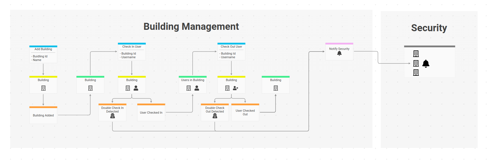

# Bonus I - Custom Projection

The product owner comes along with a new feature request. They need a way to look up the building a user is
checked into, if any.

## Exercise

Before we implement that feature you're asked to implement the *check out user* use case.
Add a command `CheckOutUser` and an event `UserCheckedOut`. Let the `Building` aggregate and `Building\State` handle the command
and make sure that `DoubleCheckOutDetected` can also be monitored using the monitoring UI.



{.alert .alert-info}
The screenshot is taken from [InspectIO](https://github.com/event-engine/inspectio){: class="alert-link"} - a domain modelling tool for (remote) teams that supports living documentation.
Event Engine users can request free access in the chat.

**Does it work? Great!**

## Implement a Projector

What we need is a list of usernames and a reference to the building they are checked into.
A custom projection can keep track of `UserCheckedIn` and `UserCheckedOut` events to keep the list up-to-date.

First check in John again (in case he is checked out because you've successfully tested the `CheckOutUser` command)!

To do that we need our own `EventEngine\Projecting\Projector` implementation. Create a new class called
`UserBuildingList` in `src/Domain/Projector` with the following content:

```php
<?php
declare(strict_types=1);

namespace MyService\Domain\Projector;

use EventEngine\DocumentStore\DocumentStore;
use MyService\Domain\Api\Event;
use MyService\Domain\Api\Payload;
use EventEngine\Messaging\Message;
use EventEngine\Projecting\AggregateProjector;
use EventEngine\Projecting\Projector;

final class UserBuildingList implements Projector
{
    /**
     * @var DocumentStore
     */
    private $documentStore;

    public function __construct(DocumentStore $documentStore)
    {
        $this->documentStore = $documentStore;
    }

    public function prepareForRun(string $projectionVersion, string $projectionName): void
    {
        if(!$this->documentStore->hasCollection(self::generateCollectionName($projectionVersion, $projectionName))) {
            $this->documentStore->addCollection(
                self::generateCollectionName($projectionVersion, $projectionName)
            /* Note: we could pass index configuration as a second argument, see docs for details */
            );
        }
    }

    public function handle(string $projectionVersion, string $projectionName, Message $event): void
    {
        $collection = self::generateCollectionName($projectionVersion, $projectionName);

        switch ($event->messageName()) {
            case Event::USER_CHECKED_IN:
                $this->documentStore->addDoc(
                    $collection,
                    $event->get(Payload::NAME), //Use username as doc id
                    [Payload::BUILDING_ID => $event->get(Payload::BUILDING_ID)]
                );
                break;
            case Event::USER_CHECKED_OUT:
                $this->documentStore->deleteDoc($collection, $event->get(Payload::NAME));
                break;
            default:
                //Ignore unknown events
        }
    }

    public function deleteReadModel(string $appVersion, string $projectionName): void
    {
        $this->documentStore->dropCollection(self::generateCollectionName($appVersion, $projectionName));
    }

    public static function generateCollectionName(string $projectionVersion, string $projectionName): string
    {
        //We can use the naming strategy of the aggregate projector for our custom projection
        return AggregateProjector::generateCollectionName($projectionVersion, $projectionName);
    }
}

```
Make the projector available as a service in `src/Domain/DomainServices`:

```php
<?php
declare(strict_types=1);

namespace MyService\Domain;

use MyService\Domain\Api\Aggregate;
use MyService\Domain\Api\Command;
use MyService\Domain\Api\Event;
use MyService\Domain\Api\Listener;
use MyService\Domain\Api\Projection;
use MyService\Domain\Api\Query;
use MyService\Domain\Api\Type;
use MyService\Domain\Projector\UserBuildingList;
use MyService\Domain\Resolver\BuildingResolver;

trait DomainServices
{
    public function buildingResolver(): BuildingResolver
    {
        return $this->makeSingleton(BuildingResolver::class, function () {
            return new BuildingResolver($this->documentStore());
        });
    }

    public function userBuildingListProjector(): UserBuildingList
    {
        return $this->makeSingleton(UserBuildingList::class, function () {
            return new UserBuildingList($this->documentStore());
        });
    }

    public function domainDescriptions(): array
    {
        return [
            Type::class,
            Command::class,
            Event::class,
            Query::class,
            Aggregate::class,
            Projection::class,
            Listener::class,
        ];
    }
}

```

And describe the projector in `src/Domain/Api/Projection`:

```php
<?php

declare(strict_types=1);

namespace MyService\Domain\Api;

use EventEngine\EventEngine;
use EventEngine\EventEngineDescription;
use EventEngine\Persistence\Stream;
use MyService\Domain\Projector\UserBuildingList;

class Projection implements EventEngineDescription
{
    const USER_BUILDING_LIST = 'user_building_list';

    /**
     * @param EventEngine $eventEngine
     */
    public static function describe(EventEngine $eventEngine): void
    {
        $eventEngine->watch(Stream::ofWriteModel())
            ->with(self::USER_BUILDING_LIST, UserBuildingList::class)
            ->filterEvents([
                Event::USER_CHECKED_IN,
                Event::USER_CHECKED_OUT,
            ]);
    }
}

```

{.alert .alert-warning}
Projections are deactivated by default, because we assume that you want to start with the `MultiModelStore` only.
Added deployment complexity and eventual consistency are the main drawbacks of projections. On the other hand, they help 
to keep queries simple and fast. During my developer career I've spent countless hours with analyzing, migrating and
improving query logic. Developers tend to put too much logic into queries. We've learned to normalize the write model
to keep it consistent and throw SQL, Elastic, MongoDB, ... query power against every problem. More often than not,
this ends up in large and complex queries, hard to understand, debug and expand. Sounds familiar? Projections to the rescue!

Having said this, let's activate the default **write-model-projection** shipped with the skeleton. It's a [prooph/event-store v7
read model projection](http://docs.getprooph.org/event-store/projections.html#3-4-3), that watches the standard write model stream
of Event Engine. To activate it, uncomment the appropriate docker container in `docker-compose.yml`:

```yaml
  event_engine_projection:
    image: prooph/php:7.2-cli
    volumes:
      - .:/app
    depends_on:
      - postgres
    command: php /app/bin/event_engine_projection.php
    # Needed so that projection is automatically restarted when new events are registered in event engine
    restart: on-failure
    env_file:
      - ./app.env
```
and start it with:

```bash
docker-compose up -d
```

If you look at the Postgres DB you should see a new table called `user_building_list_0_1_0` with one row:

id | doc
---|---
John | {"buildingId": "9ee8d8a8-3bd3-4425-acee-f6f08b8633bb"}

{.alert .alert-warning}
If the table is empty make sure that you've checked in John. If that's the case, your projection might have a problem. Check the troubleshooting section
of the skeleton [README](https://github.com/event-engine/php-engine-skeleton#troubleshooting).

{.alert .alert-info}
The **write-model-projection** is a single long-running php process. It polls the event store for new events and forwards them to Event Engine. 
Event Engine checks its projection descriptions and invokes all projectors interested in the forwarded events. If you add another projection
and want to fill it with past data, you can run the script `docker-compose run --rm php php bin/reset.php`. Projections are versioned 
(version can be defined as a third argument in the projection description, default is 0.1.0). This way,
it's possible to generate a new read model version during deployment while the old version is still available (version is part of the table name).

## Look up

We can add a new query, resolver and corresponding type definitions to complete the look up feature.

*src/Domain/Api/Type*
```php
<?php

declare(strict_types=1);

namespace MyService\Domain\Api;

use MyService\Domain\Model\Building;
use EventEngine\EventEngine;
use EventEngine\EventEngineDescription;
use EventEngine\JsonSchema\JsonSchema;
use EventEngine\JsonSchema\Type\ObjectType;

class Type implements EventEngineDescription
{
    const HEALTH_CHECK = 'HealthCheck';
    const USER_BUILDING = 'UserBuilding'; //<-- new type

    /* ... */

    private static function userBuilding(): ObjectType
    {
        return JsonSchema::object([
            'user' => Schema::username(),
            'building' => Schema::building()->asNullable(), //<-- type ref to building, can be null
        ]);
    }

    /**
     * @param EventEngine $eventEngine
     */
    public static function describe(EventEngine $eventEngine): void
    {
        $eventEngine->registerType(Aggregate::BUILDING, self::building());

        $eventEngine->registerType(self::USER_BUILDING, self::userBuilding()); //<-- type registration
    }
}

```
*src/Domain/Api/Schema*
```php
<?php

declare(strict_types=1);

namespace MyService\Domain\Api;

use EventEngine\JsonSchema\JsonSchema;
use EventEngine\JsonSchema\Type\ArrayType;
use EventEngine\JsonSchema\Type\StringType;
use EventEngine\JsonSchema\Type\TypeRef;
use EventEngine\JsonSchema\Type\UuidType;

class Schema
{
    /* ... */

    public static function username(): StringType
    {
        return JsonSchema::string()->withMinLength(1);
    }

    public static function userBuilding(): TypeRef
    {
        return JsonSchema::typeRef(Type::USER_BUILDING);
    }

    /* ... */
}

```

*src/Domain/Resolver/UserBuildingResolver*
```php
<?php
declare(strict_types=1);

namespace MyService\Domain\Resolver;

use EventEngine\DocumentStore\DocumentStore;
use EventEngine\Messaging\Message;
use EventEngine\Querying\Resolver;
use MyService\Domain\Api\Payload;

final class UserBuildingResolver implements Resolver
{
    /**
     * @var DocumentStore
     */
    private $documentStore;

    /**
     * @var string
     */
    private $userBuildingCollection;

    /**
     * @var string
     */
    private $buildingCollection;

    public function __construct(DocumentStore $documentStore, string $userBuildingCol, string $buildingCol)
    {
        $this->documentStore = $documentStore;
        $this->userBuildingCollection = $userBuildingCol;
        $this->buildingCollection = $buildingCol;
    }

    public function resolve(Message $query): array
    {
        $userBuilding = $this->documentStore->getDoc(
            $this->userBuildingCollection,
            $query->get(Payload::NAME)
        );

        if(!$userBuilding) {
            return [
                'user' => $query->get(Payload::NAME),
                'building' => null
            ];
        }

        $building = $this->documentStore->getDoc(
            $this->buildingCollection,
            $userBuilding['buildingId']
        );

        if(!$building) {
            return [
                'user' => $query->get(Payload::NAME),
                'building' => null
            ];
        }

        return [
            'user' => $query->get(Payload::NAME),
            'building' => $building['state'],
        ];
    }
}

```

*src/Domain/DomainServices*
```php
<?php
declare(strict_types=1);

namespace MyService\Domain;

use MyService\Domain\Api\Aggregate;
use MyService\Domain\Api\Command;
use MyService\Domain\Api\Event;
use MyService\Domain\Api\Listener;
use MyService\Domain\Api\Projection;
use MyService\Domain\Api\Query;
use MyService\Domain\Api\Type;
use MyService\Domain\Projector\UserBuildingList;
use MyService\Domain\Resolver\BuildingResolver;
use MyService\Domain\Resolver\UserBuildingResolver;

trait DomainServices
{
    public function buildingResolver(): BuildingResolver
    {
        return $this->makeSingleton(BuildingResolver::class, function () {
            return new BuildingResolver($this->documentStore());
        });
    }

    public function userBuildingResolver(): UserBuildingResolver
    {
        return $this->makeSingleton(UserBuildingResolver::class, function () {
            return new UserBuildingResolver(
                $this->documentStore(),
                UserBuildingList::generateCollectionName(
                    '0.1.0', 
                    Projection::USER_BUILDING_LIST),
                BuildingResolver::COLLECTION
            );
        });
    }

    public function userBuildingListProjector(): UserBuildingList
    {
        return $this->makeSingleton(UserBuildingList::class, function () {
            return new UserBuildingList($this->documentStore());
        });
    }

    public function domainDescriptions(): array
    {
        return [
            Type::class,
            Command::class,
            Event::class,
            Query::class,
            Aggregate::class,
            Projection::class,
            Listener::class,
        ];
    }
}

```

*src/Domain/Api/Query*
```php
<?php

declare(strict_types=1);

namespace MyService\Domain\Api;

use MyService\Domain\Resolver\UserBuildingResolver;
use ...

class Query implements EventEngineDescription
{
    /* ... */
    const USER_BUILDING = 'UserBuilding';

    public static function describe(EventEngine $eventEngine): void
    {
        /* ... */

        $eventEngine->registerQuery(
            self::USER_BUILDING,
            JsonSchema::object(['name' => Schema::username()])
        )
            ->resolveWith(UserBuildingResolver::class)
            ->setReturnType(Schema::userBuilding());
    }
}

```
*Cockpit - UserBuilding query*
```json
{
  "name": "John"
}
```

*Response*
```json
{
  "user": "John",
  "building": {
    "name": "Acme Headquarters",
    "users": [
      "John"
    ],
    "buildingId": "9ee8d8a8-3bd3-4425-acee-f6f08b8633bb"
  }
}
```

{.alert .alert-success}
An hour of work (with a bit more practice even less) and we are ready to ship the new feature! Rapid application development at its best!
RAD is ok, but please don't skip testing! In the second bonus part of the tutorial we'll learn that Event Engine makes it
easy to run integration tests. Don't miss it!
