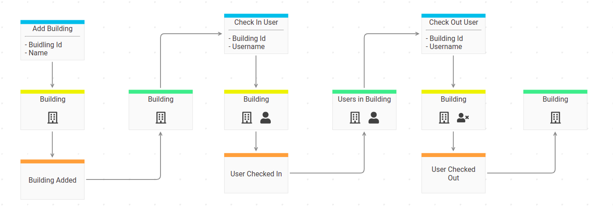

# Introduction

Event Engine is a rapid application development (RAD) framework. The basic concepts will be explained throughout the tutorial.
Once finished, you should be able to start with your own project. The API docs will help you along the way.

## Tutorial Domain

We're going to build a backend for a small web application where you can register `buildings` and then `check in` and `check out`
users in the buildings. The backend will expose a messagebox endpoint that excepts commands and queries.
Each time a user is `checked in` or `checked out` we get a notification via a websocket connection.



{.alert .alert-info}
The screenshot is taken from [InspectIO](https://github.com/event-engine/inspectio){: class="alert-link"} - a domain modelling tool for (remote) teams that supports living documentation.
Event Engine users can request free access in the chat.

{.alert .alert-light}
*Credits: The tutorial domain is the same as the one used by Marco Pivetta in his CQRS and Event Sourcing Workshops.*

## Application set up

Please make sure you have [Docker](https://docs.docker.com/engine/installation/ "Install Docker") and [Docker Compose](https://docs.docker.com/compose/install/ "Install Docker Compose") installed.

{.alert .alert-warning}
*Note: Docker is THE ONLY supported set up at the moment. If you don't want to install docker you need PHP 7.4+ and Postgres 9.4+.*

### Clone Event Engine Skeleton

Change into your working directory and use `composer` to create a new project based on the [event engine skeleton](https://github.com/event-engine/php-engine-skeleton)
using `ee-buildings` as project name.

```bash
$ docker run --rm -it -v $(pwd):/app prooph/composer:7.4 create-project event-engine/php-engine-skeleton ee-buildings
```

Change into the newly created project dir `ee-buildings`, start the docker containers and run the set up script
for the event store.

```bash
$ cd ee-buildings
$ sudo chown -R $(id -u -n):$(id -g -n) .
$ docker-compose up -d
$ docker-compose run php php scripts/create_event_stream.php
```
The last command should output `done.` otherwise it will throw an exception.

### Verify set up

#### Database
Verify database set up by connecting to the Postgres database using: 

```
host: localhost
port: 5432
dbname: event_engine
user: postgres
pwd: dev
``` 

{.alert .alert-info}
*Note: Credentials are defined in `app.env` and can be changed there.*

You should see three tables: `event_streams`, `projections` and `_<sha1>`. The latter is a table created by `prooph/event-store`.
It will contain all `domain events`.

#### Webserver
Head over to [https://localhost](https://localhost) to check if the containers are up and running.
After accepting the self-signed certificate you should see a simple "It works" message.

#### Event Engine Cockpit
By default Event Engine exposes commands (we will learn more about them in a minute), events, and queries via a message box endpoint.
We can use [Event Engine Cockpit](https://github.com/event-engine/cockpit) to interact with the backend.

The Event Engine skeleton ships with a ready to use Cockpit configuration. Open [https://localhost:4444](https://localhost:4444)
in your browser and try the built-in `HealthCheck` query.

You should get a JSON response similar to that one:

```json
{
  "system": true
}
```

{.alert .alert-success}
If everything works correctly we are ready to implement our first use case: **Add a building**

{.alert .alert-danger}
If something is not working as expected (now or later in the tutorial) please check the trouble shooting section 
of the [event-engine/php-engine-skeleton README](https://github.com/event-engine/php-engine-skeleton/blob/master/README.md#troubleshooting){: class="alert-link"} first.


